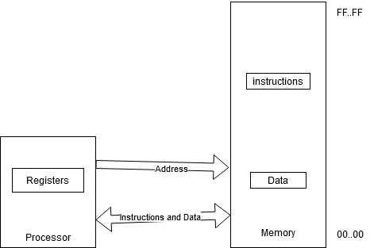

# 1.1 Processor Architecture and Organization
## Computer Architecture

The User's view of the computer. This is things like the instruction set, visible registers, memory management table structure, and exception handling.

## Computer Organization

The user-invisible implementation of the architecture. Pipeline structure, transparent caches, table-walking hardware, and translation look-aside buffers are all a part of the Computer Organization.

## What is a processor?

It's a general purpose finite-state machines that executes actions based on the instructions that are held in memory. The state of the system is defined by both the data that is held in memory, and the data that is held in the registers.

## Stored-program computer

The stored-program computer is a computer that store its instructions and data in the same memory system. This allows the computer to treat instructions as data, and thus generate instructions when needed. You shouldn't let the computer do fine grain code generation since it's hard to debug, but course grain code generation is fundamental in modern computer systems.

## Computer Applications

Since stored-program computers are programmable, they can be used for anything. They can undertake any tasks that are defined by a suitable algorithm, and they can also be used for very specific applications at the same time.

